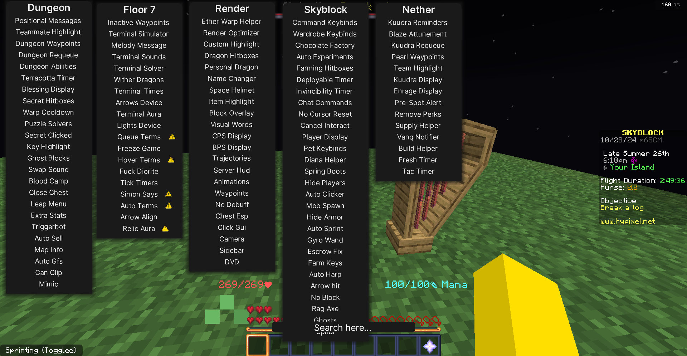

# Mod-Skyblock-Hypixel
## Mod For Hypixel

### OdinClient Mod
OdinClient is a client specifically created for Hypixel Skyblock that offers advanced features to enhance gameplay and automate some repetitive tasks. In addition to improving game performance by reducing lag, OdinClient is highly appreciated for its automation functions, such as:

  ● Music harp automation, which makes it much easier to complete required musical pieces and earn skill rewards, a challenge that would otherwise be much more difficult and require manual precision.
  
  ● Enchanting table automation, which allows players to quickly maximize their enchanting level, making skill farming faster and more efficient.
  
  ● Stat tracker, which keeps track of progress by showing real-time experience and coin gains.
  
OdinClient is very useful for players who want to progress in skills without wasting too much time on repetitive tasks and who want to monitor their performance and earnings in detail. Thanks to its automation features, it allows players to optimize their gameplay time and focus on the more fun and challenging aspects of the game.

### Dungeon Rooms Mod
Dungeon Rooms Mod is designed to help players navigate dungeons, which are among the most challenging aspects of Hypixel Skyblock. This mod is especially useful for those who want to complete dungeons quickly and earn high-level rewards, and it offers features such as:

  ● Room identification: with visual indicators, players can quickly understand what type of room they are about to face and where they are in relation to objectives.
  
  ● Secret markers: the mod helps to easily locate secrets within rooms, which is essential for achieving high scores in dungeons and unlocking better rewards.
  
  ● Optimized navigation: the mod allows players to move more efficiently, reducing the time needed to complete rooms and enhancing overall strategy.
  
Dungeon Rooms Mod is perfect for players who want to improve their dungeon performance, avoiding wasted time and increasing their chances of success.

***If you’re unsure about these files, you can verify them using scanning services like [VirusTotal](https://www.virustotal.com) or [IsThisARat](https://www.isthisarat.com/), which allow you to check for viruses, malware, or other security risks.***
